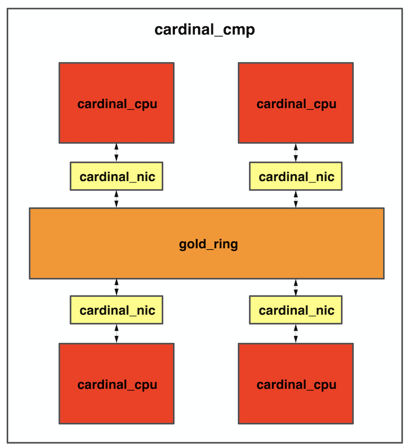

<!--
 * @Author: Yihao Wang
 * @Date: 2020-04-25 18:11:14
 * @LastEditTime: 2020-05-06 03:45:33
 * @LastEditors: Please set LastEditors
 * @Description: README.md for entire project
 * @FilePath: /EE577b_final_project/README.md
 -->
 **Chip Multi-processor System based on Cardinal Bidirectional Ring Network-on-chip**
===========
***Abstract***
----------
This Cardinal 4-core chip multi-processor system is implemented based on Cardinal processor with 32-bit address and 64-bit data and Cardinal 4-node ring NoC which supports packet (VCT or wormhole) switching. Cardinal NiC is short for network interface components that can be used to simplify packets changing between ring NoC and processors. Each register or buffer of NiC can be accessed using 2-bit memory address so memory instructions (LD or SW) can be used to access NiC and make it possible to transfer messages between different IP cores.

[***Instruction Set Spec***](./Docs/project_p2/cardinal_processor_ISA.pdf)

***Block Diagram***
------------------

***Contents***
-----------
**./Docs**                     
&emsp;&emsp;All documents and spec files related to this project;

**./project/design**            
&emsp;&emsp;All design source files;

**./project/include**           
&emsp;&emsp;Related library files (gscl45nm) and simulation models used in simulation;

**./project/netlist**           
&emsp;&emsp;&emsp;Netlist file (.v), standard delay files (.sdf) and contraints files (.sdc) generated by Design; Compiler;

**./project/pnr**              
&emsp;&emsp;Screenshot and log file of Cadence Innovus (P & R);

**./project/report**            
&emsp;&emsp;Timing, area, power and also design checking log file generated by Design Compiler;

**./project/scripts**           
&emsp;&emsp;Tcl scripts used by NC-Sim and Design Compiler;

**./project/src**               
&emsp;&emsp;Source file used by Design Compiler to do logic synthesis;

**./project/tb**                
&emsp;&emsp;Testbench file for individual modules;

**./project/test_cases**        
&emsp;&emsp;Test_cases used by run.csh to function testing of top CMP module;

**./project/work**              
&emsp;&emsp;Not applied;

**./peoject/makefile**          
&emsp;&emsp;Makefile used to do simulation for RTL design &emsp;&emsp;(pre-simulation) and netlist (post-simulation);

**./project/makefile_disable**  
&emsp;&emsp;Makefile used to do automatic simulation, 
synthesis and static timing analysis

**./project/run.csh**           
&emsp;&emsp;Csh scripts used to simulate the top cardinal_cmp.v or cardinal_cmp_syn.design

**./setup_v1908.csh**           
&emsp;&emsp;Used to set all lab environments out project depends on

